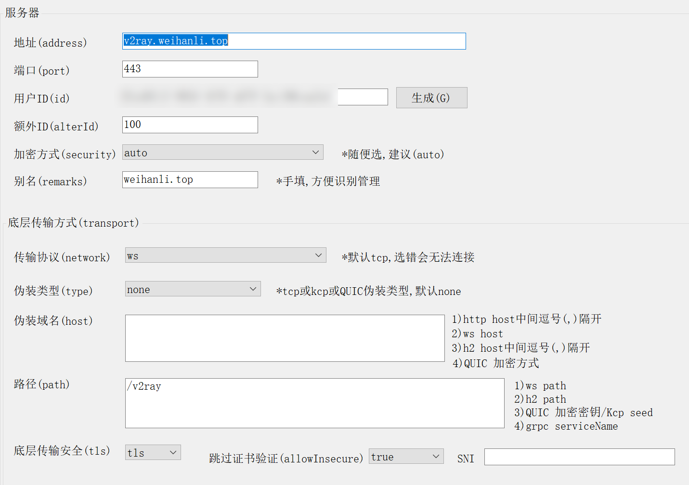
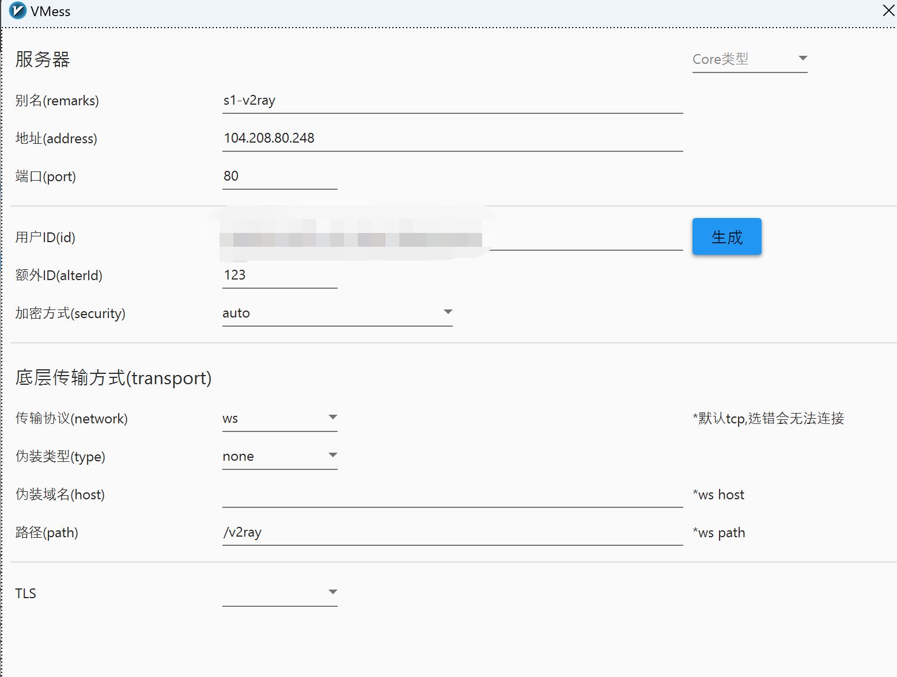

# Docker v2ray setup

## Prepare

Firstly you need to prepare a nginx config to proxy requests to v2ray

WebSocket with TLS sample nginx config:

``` conf
server {
    listen 443;
    server_name v2ray.weihanli.top;
    sendfile                on;
    tcp_nopush              on;
    tcp_nodelay             on;
    keepalive_requests      25600;
    keepalive_timeout       65;
    
    add_header Strict-Transport-Security "max-age=63072000" always;
    ssl_stapling on;
    ssl_stapling_verify on;

     location /v2ray {
        proxy_redirect off;
        proxy_set_header Upgrade $http_upgrade;
        proxy_set_header Connection "upgrade";
        proxy_set_header Host $http_host;
        proxy_read_timeout 300s;
        proxy_set_header X-Real-IP $remote_addr;
        proxy_set_header X-Forwarded-For $proxy_add_x_forwarded_for;
        proxy_pass http://localhost:9000;
     }
}
```

Websocket with TLS v2ray sample config:

``` json
{
    "inbounds": [
      {
        "port": 9000,
        "protocol": "vmess",
        "settings": {
          "clients": [
            {
              "id": "<your uuid>",
              "level": 0,
              "alterId": 100
            }
          ]
        },
        "streamSettings": {
          "network": "ws",
          "wsSettings": {
            "path": "/v2ray"
          }
        }
      }
    ],
    "outbounds": [
      {
        "protocol": "freedom",
        "settings": {}
      }
    ]
}
```

WebSocket without TLS sample nginx config:

``` conf
server {
    listen 80;
    server_name _;
    
     location /v2ray {
        proxy_redirect off;
        proxy_set_header Upgrade $http_upgrade;
        proxy_set_header Connection "upgrade";
        proxy_set_header Host $http_host;
        proxy_read_timeout 300s;
        proxy_set_header X-Real-IP $remote_addr;
        proxy_set_header X-Forwarded-For $proxy_add_x_forwarded_for;
        proxy_pass http://localhost:9000;
     }
}
```

Websocket without TLS v2ray sample config:

``` json
{
    "inbounds": [
      {
        "port": 9000,
        "protocol": "vmess",
        "settings": {
          "clients": [
            {
              "id": "<your uuid>",
              "level": 0,
              "alterId": 100
            }
          ]
        },
        "streamSettings": {
          "network": "ws",
          "security": "none",
          "wsSettings": {
              "path": "/v2ray"
          }
        }
      }
    ],
    "outbounds": [
      {
        "protocol": "freedom",
        "settings": {}
      }
    ]
}
```

More configuration examples: <https://github.com/v2fly/v2ray-examples>

## Update v2ray config

Update the `config.json` in config folder, update the `id` value with a guid value, and it will be used when you config the client, and you can config more than one client

## Run docker-compose

When everything is ready, you can run `docker-compose up -d` to start the v2ray service

## Client configuration

1. Download client from the <https://www.v2ray.com/awesome/tools.html>, for windows, download from <https://github.com/2dust/v2rayN>
2. websocket with tls sample client configuration, id is the guid you configured in the `config.json`
  
  Clash proxy config sample:
  
      ``` yaml
      proxies:
      - name: "vmess-v2ray"
        type: vmess
        server: example.com
        port: 443
        uuid: <your-uuid>
        alterId: 100
        cipher: auto
        tls: true
        skip-cert-verify: true
        servername: example.com
        network: ws
        ws-opts:
          path: /v2ray
      ```

3. web socket without tls sample client configuration 
  
  Clash proxy config sample:

      ``` yaml
      proxies:
      - name: "vmess-v2ray"
        type: vmess
        server: 102.202.222.242
        port: 80
        uuid: <your-uuid>
        alterId: 100
        cipher: auto
        # tls: true
        # skip-cert-verify: true
        # servername: example.com # priority over wss host
        network: ws
        ws-opts:
          path: /v2ray
      ```

## PreConfigure

``` sh
sudo yum install -y yum-utils
sudo yum-config-manager --add-repo https://download.docker.com/linux/centos/docker-ce.repo
sudo yum install docker-ce docker-ce-cli containerd.io -y
sudo systemctl start docker
sudo systemctl enable docker

sudo usermod -aG docker <userName>

# uninstall docker
# sudo yum remove docker-ce docker-ce-cli containerd.io
# remove docker files
# sudo rm -rf /var/lib/docker

# docker-compose
compose_version=$(curl -s https://api.github.com/repos/docker/compose/releases/latest | grep 'tag_name' | cut -d\" -f4)
sudo curl -L "https://github.com/docker/compose/releases/download/${compose_version}/docker-compose-$(uname -s)-$(uname -m)" -o /usr/local/bin/docker-compose
sudo chmod +x /usr/local/bin/docker-compose

# nginx
sudo yum install nginx -y
sudo systemctl enable nginx

# bbr
sudo echo "net.core.default_qdisc=fq" | sudo tee --append /etc/sysctl.conf
sudo echo "net.ipv4.tcp_congestion_control=bbr" | sudo tee --append /etc/sysctl.conf
sudo sysctl -p
```
